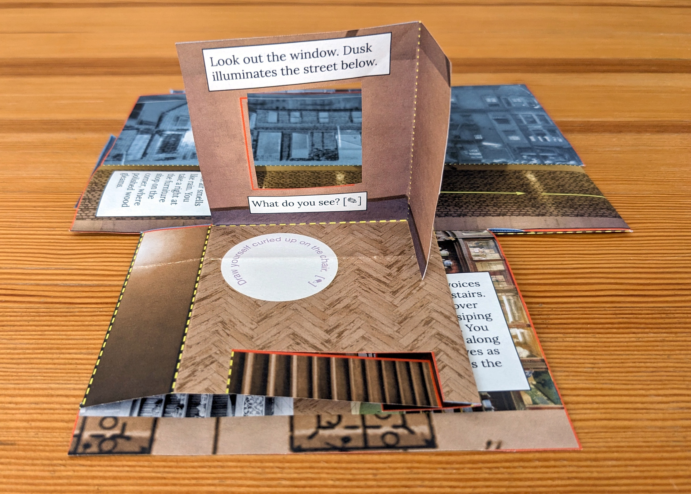

# Providence Chinatown, 1914: an enfolded memory path

## _Jeffrey Yoo Warren & Dri Chiu Tattersfield for DIY Methods_

In the Seeing Lost Enclaves project, we have been carefully researching displaced Chinatown communities through archival research, 3D modeling, zinemaking, and other mediums, with a focus on personal (re)connection, community building, and process reflections, through a process called relational reconstruction. 

This zine interweaves a speculative story from the displaced historical Chinatown in Providence, RI with the story of this project and what we have learned from experimenting with care-oriented, multimodal research methods. The story unfolds as a path through the Providence Chinatown neighborhood in 1914 based on Jeffrey’s modeling work. 

We are excited by zines’ potential to serve as a more accessible, non-digital way to share our Chinatown reconstructions with elders and descendants of these communities. Additionally, we have been reflecting deeply on the idea of our model reconstructions as virtual altars, in conversation with family histories of altar-building for ancestors. Paper plays an important role in ancestor offerings, such as burning paper money. How is folding a zine like constructing an altar? We invite you to explore this prompt at the end of our zine. 

With care,
 Jeffrey & Dri
 <a href="https://unterbahn.com">unterbahn.com</a> &amp; <a href="https://hellodri.itch.io">hellodri.itch.io</a>

Image: You're in a small dormitory room with a wooden floor and plaster walls. Two windows open onto the cobblestone street a floor below. 

Text: Look out the window. Dusk illuminates the street below. What do you see?

Prompt: Draw yourself curled up on a chair.

Image: At the back of the room, a narrow staircase leads down to the first floor. 

Text: The murmur of voices draws you downstairs. Your aunt leans over the counter, gossiping with a customer. You run your fingers along the narrow shelves as you walk towards the door. 

Image: A narrow passage leads between two wooden shelves crowded with shiny porcelain teapots, bowls, vases and, on the top shelf behind glass, boxes with more merchandise. 

Prompt: Which item do you linger on?

Image: As you walk out the door onto the cobblestones, there are several doors open in the small wooden buildings across the street, the facades of which are collaged from old newspapers and photos. Warm light spills onto the street from doors and from windows on the second floors. To your right, down the street, a small theater and tailor shop sit across the intersection with a wider street.

Text: Outside, the cool air smells like rain. You take a right at the furniture shop, where polished wood gleams.

Image: Turning the corner, you notice more shops on both sides of the street, outside of Chinatown. More tailors, shoe stores, signs for Singer sewing machines, and more. The wide street slopes up towards the distant towers of a cathedral. 

Text: You turn left on Burrill Street, passing the tailor and the back entrance of the Empire Theatre, which you have never entered.

