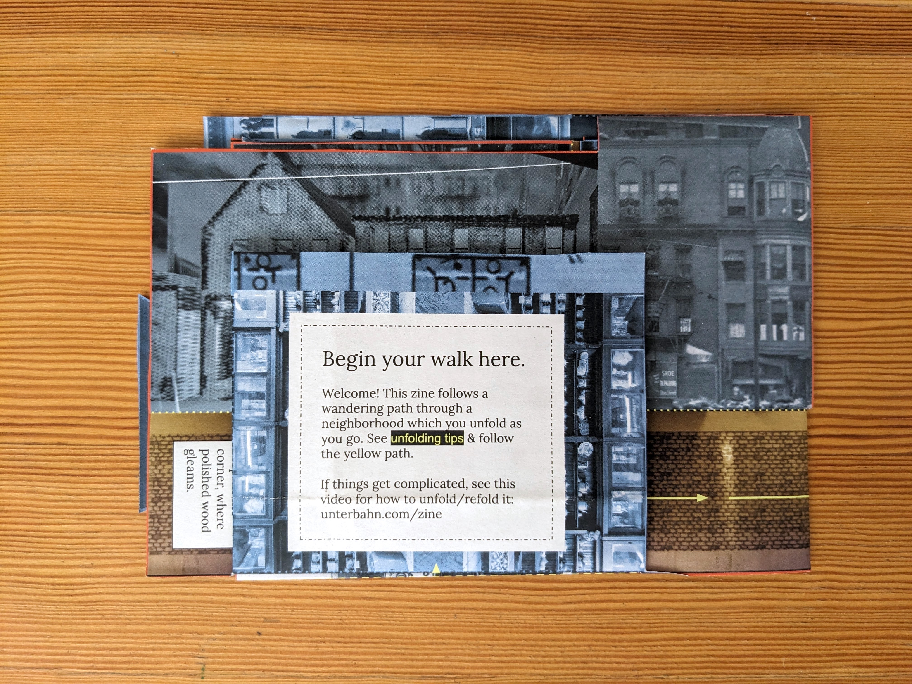

# Providence Chinatown, 1914: an enfolded memory path

## _Jeffrey Yoo Warren & Dri Chiu Tattersfield for DIY Methods_

In the Seeing Lost Enclaves project, we have been carefully researching displaced Chinatown communities through archival research, 3D modeling, zinemaking, and other mediums, with a focus on personal (re)connection, community building, and process reflections, through a process called relational reconstruction.

This zine interweaves a speculative story from the displaced historical Chinatown in Providence, RI with the story of this project and what we have learned from experimenting with care-oriented, multimodal research methods. The story unfolds as a path through the Providence Chinatown neighborhood in 1914 based on Jeffrey’s modeling work. 

We are excited by zines’ potential to serve as a more accessible, non-digital way to share our Chinatown reconstructions with elders and descendants of these communities. Additionally, we have been reflecting deeply on the idea of our model reconstructions as virtual altars, in conversation with family histories of altar-building for ancestors. Paper plays an important role in ancestor offerings, such as burning paper money. How is folding a zine like constructing an altar? We invite you to explore this prompt at the end of our zine. 

With care,
 Jeffrey & Dri
 <a href="https://unterbahn.com">unterbahn.com</a> &amp; <a href="https://hellodri.itch.io">hellodri.itch.io</a>

